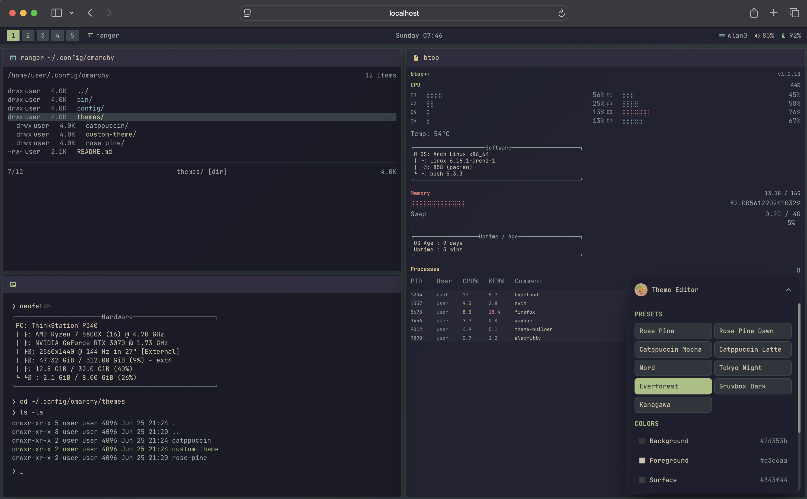
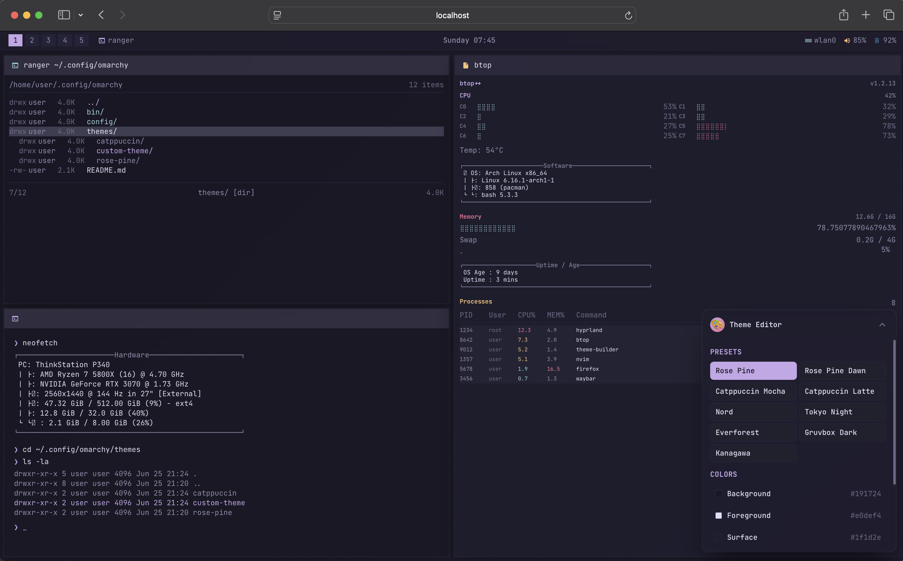

# 🎨 Omarchy Theme Builder

An interactive, real-time theme builder for the Omarchy Linux desktop environment. Create beautiful desktop themes with instant visual feedback and **full keyboard accessibility**, just like Realtime Colors but for your entire desktop.


## 📸 Demo Screenshots

<div align="center">


*Theme Builder Interface - Real-time color editing with keyboard navigation*


*Authentic Omarchy Desktop Simulation - Live preview with btop system monitor*

</div>

## ✨ Features

### 🖥️ Authentic Desktop Simulation
- **Pixel-perfect Omarchy/Hyprland desktop** preview in your browser
- **Realistic system monitoring** with btop using authentic braille progress bars
- **Sharp 90° corners** and ASCII-style borders matching real terminals
- **Interactive panels**: file manager (ranger-style), terminal, and system monitor
- **Live system stats** with animated CPU cores, memory usage, and process lists

### ⌨️ Full Keyboard Navigation (WCAG 2.1 AA)
- **Complete keyboard accessibility** - navigate entirely without a mouse
- **Smart focus management** with visible indicators and focus trapping
- **Keyboard shortcuts** for all major functions (press `?` for help)
- **Screen reader support** with proper ARIA labels and announcements
- **Skip links** and semantic markup for assistive technologies
- **Test suite** available at `/keyboard-test` to verify navigation

### 🎨 Real-Time Theme Editing
- **Instant Visual Feedback**: Changes appear immediately across all components
- **Color Palette Editor**: Customize background, foreground, accent, and semantic colors
- **Quick Theme Access**: Number keys (1-7) for instant preset switching
- **Keyboard Color Picking**: Navigate and edit colors entirely with keyboard
- **Preset Themes**: Rose Pine, Tokyo Night, Catppuccin, Nord, Everforest, Gruvbox, and more

### 📦 Complete Theme Export
Generate a ready-to-use theme package containing:
- `hyprland.conf` - Window manager configuration
- `waybar.css` - Status bar styling
- `alacritty.toml` - Terminal colors
- `mako.ini` - Notification daemon
- `neovim.lua` - Editor theme
- `btop.theme` - System monitor colors
- Plus configurations for Walker launcher, SwayOSD, and more!

### 🚀 Modern Tech Stack
- **SvelteKit** - Fast, reactive framework
- **Tailwind CSS** - Utility-first styling
- **JSZip** - Theme export functionality
- **Custom Focus Manager** - Advanced keyboard navigation system
- **Responsive Design** - Works on desktop, tablet, and mobile

## 🚀 Quick Start

### Prerequisites
- Node.js 18+
- npm or yarn

### Installation

```bash
# Clone the repository
git clone https://github.com/your-username/omarchy-theme-builder.git
cd omarchy-theme-builder

# Install dependencies
npm install

# Start development server
npm run dev
```

Visit `http://localhost:5173` to start building themes!

### Building for Production

```bash
npm run build
npm run preview
```

## ⌨️ Keyboard Navigation

This theme builder is fully keyboard accessible! Here's how to get started:

### Essential Shortcuts
| Key | Action |
|-----|--------|
| `Tab` | Enable keyboard mode & navigate |
| `T` | Toggle theme controls |
| `?` or `H` | Show keyboard shortcuts help |
| `E` | Export current theme |
| `1-7` | Quick theme presets |
| `Enter`/`Space` | Activate focused element |
| `Escape` | Close modals/panels |

### Navigation Flow
1. Press `Tab` to enable keyboard navigation mode
2. Use `Tab` and `Shift+Tab` to move between elements
3. Press `T` to open theme controls
4. Navigate colors with `Tab`, press `Enter` to edit
5. Use number keys for quick theme switching
6. Press `E` to export your theme

**Full documentation**: See [KEYBOARD_NAVIGATION.md](KEYBOARD_NAVIGATION.md) for complete shortcuts and accessibility features.

## 🎯 How It Works

1. **Open the Theme Builder** - Load the app in your browser
2. **Enable Keyboard Mode** - Press `Tab` to start navigating
3. **Customize Colors** - Press `T` or click theme controls in the bottom-right
4. **See Live Changes** - Watch your authentic desktop simulation update in real-time
5. **Try Presets** - Use number keys 1-7 for instant theme switching
6. **Export Theme** - Press `E` or click export for a complete theme package
7. **Apply to Omarchy** - Extract and apply the theme to your real desktop

## 🏗️ Desktop Layout

The simulation features an authentic three-panel layout matching real Omarchy setups:

```
┌─────────────────┬─────────────────────────────────┐
│                 │                                 │
│   File Manager  │                                 │
│   (ranger)      │         System Monitor          │
│                 │         (btop)                  │
├─────────────────┤                                 │
│                 │                                 │
│   Terminal      │                                 │
│   (neofetch)    │                                 │
│                 │                                 │
└─────────────────┴─────────────────────────────────┘
```

## 🎨 Theme Structure

The exported theme follows Omarchy's standard structure:

```
omarchy-my-theme-theme/
├── hyprland.conf         # Window manager config
├── waybar.css           # Status bar styles
├── alacritty.toml       # Terminal colors
├── mako.ini             # Notifications
├── neovim.lua           # Editor theme
├── btop.theme           # System monitor
├── walker.css           # App launcher
├── swayosd.css          # Volume/brightness OSD
├── hyprlock.conf        # Screen locker
├── icons.theme          # Icon theme name
├── light.mode           # Light mode indicator (if applicable)
├── README.md            # Theme documentation
└── theme.conf           # Main theme configuration
```

## 🛠️ Development

### Project Structure

```
src/
├── lib/
│   ├── components/              # Svelte components
│   │   ├── Desktop.svelte       # Main desktop simulator
│   │   ├── TopPanel.svelte      # System panel with keyboard nav
│   │   ├── ThemeControls.svelte # Fully keyboard accessible controls
│   │   ├── KeyboardHelpModal.svelte # Shortcuts help
│   │   └── NotificationToast.svelte
│   ├── stores/
│   │   ├── theme.js             # Theme state management
│   │   └── keyboard.js          # Keyboard navigation system
│   └── utils/
│       └── themeExport.js       # Theme export logic
├── routes/
│   ├── keyboard-test/           # Accessibility test suite
│   └── +page.svelte             # Main app
└── app.css                      # Global styles with keyboard focus
```

### Key Design Principles

- **Accessibility First**: WCAG 2.1 AA compliant with comprehensive keyboard navigation
- **Real-time Updates**: All theme changes applied instantly using Svelte stores
- **Authentic Simulation**: Pixel-perfect recreation of real Omarchy desktop elements
- **CSS Variables**: Dynamic theming through CSS custom properties
- **Component Isolation**: Each desktop component is self-contained and reactive
- **Progressive Enhancement**: Works with mouse, keyboard, and screen readers

## 🧪 Testing

### Keyboard Navigation Test Suite
Visit `/keyboard-test` to run our comprehensive accessibility test suite:

- ✅ Tab navigation flow
- ✅ Focus trapping in modals
- ✅ Keyboard shortcuts functionality
- ✅ Screen reader announcements
- ✅ Skip links navigation

### Manual Testing Checklist
- [ ] All interactive elements focusable with Tab
- [ ] Keyboard shortcuts work as documented
- [ ] Screen reader announces changes
- [ ] High contrast mode supported
- [ ] Theme export functions correctly

## 🤝 Contributing

We welcome contributions! This project is perfect for:

### 🎨 **Theme Designers**
- Add new theme presets
- Improve color palette selections
- Create theme variations

### ⌨️ **Accessibility Experts**
- Enhance screen reader support
- Test with assistive technologies
- Improve keyboard navigation flow

### 💻 **Frontend Developers**
- Add new desktop components
- Improve animations and transitions
- Optimize performance

### 🐧 **Linux Enthusiasts**
- Add support for other desktop environments
- Expand export format options
- Test on various distributions

### Getting Started
1. **Fork the repository**
2. **Create a feature branch**: `git checkout -b feature/amazing-feature`
3. **Test keyboard navigation**: Visit `/keyboard-test`
4. **Commit changes**: Use conventional commits
5. **Push to branch**: `git push origin feature/amazing-feature`
6. **Open a Pull Request**

### Development Guidelines
- Maintain keyboard accessibility in all new features
- Test with screen readers (NVDA, JAWS, VoiceOver)
- Follow existing code patterns and naming conventions
- Add proper ARIA labels and descriptions
- Update keyboard navigation docs for new shortcuts

## 🎨 Inspiration

This project draws inspiration from:
- **Omarchy Desktop** - The beautiful target Linux environment
- **btop++** - For authentic system monitoring aesthetics
- **Accessibility community** - For inclusive design principles

## 🐛 Troubleshooting

### Common Issues

**Keyboard navigation not working?**
- Press `Tab` to enable keyboard mode
- Check that focus indicators are visible
- Try refreshing the page if focus gets stuck

**Theme export not working?**
- Ensure your browser supports the File API
- Check that all color values are valid hex codes
- Try refreshing the page and re-applying your changes

**Desktop simulation looks wrong?**
- Clear browser cache and reload
- Ensure CSS custom properties are supported (modern browsers)
- Check browser console for any JavaScript errors

**Screen reader issues?**
- Ensure ARIA live regions are working
- Check that announcements are being made on theme changes
- Try different screen reader software

## 📄 License

This project is licensed under the MIT License - see the [LICENSE](LICENSE) file for details.

## 🙏 Acknowledgments

- **Omarchy Project** - For creating an amazing Linux desktop environment
- **SvelteKit Team** - For the excellent reactive framework
- **Accessibility community** - For guidance on inclusive design principles
- **btop++ developers** - For the incredible system monitor that inspired our simulation
- **All Contributors** - For making this project better every day

---

**Made with ❤️ and ♿ for the Omarchy community**

*Ready to build your perfect theme? [Get started now!](https://github.com/your-username/omarchy-theme-builder)*

### 🚀 **[Live Demo](https://github.com/gitcoder89431/omarchy-theme-builder)** | 📖 **[Keyboard Guide](KEYBOARD_NAVIGATION.md)** | 🧪 **[Test Suite](https://github.com/gitcoder89431/omarchy-theme-builder/keyboard-test)**
